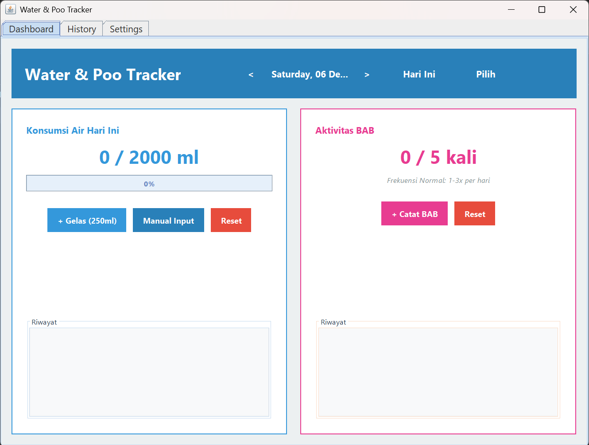
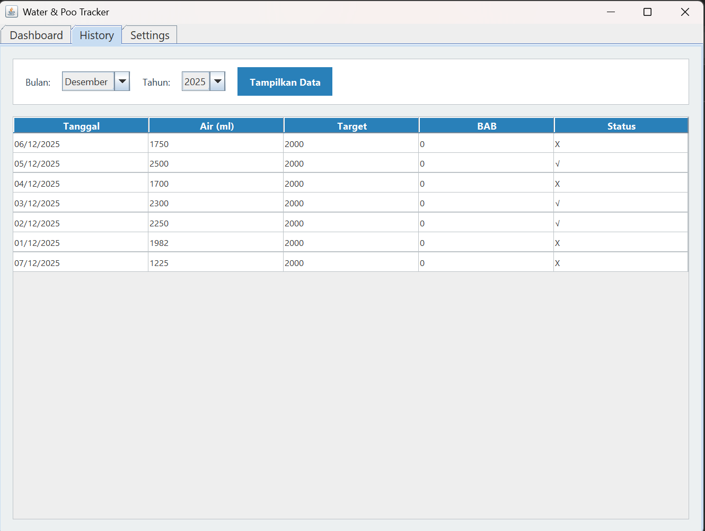
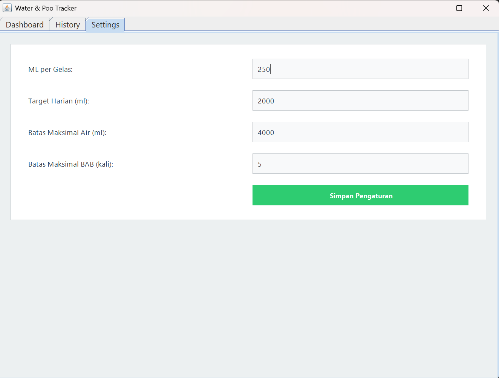

# Water & Poo Tracker

Aplikasi desktop berbasis Java untuk memantau konsumsi air harian dan aktivitas buang air besar (BAB) 


## Deskripsi

Water & Poo Tracker adalah aplikasi pelacak kesehatan yang membantu pengguna:
- Mencatat konsumsi air harian
- Melacak frekuensi buang air besar (BAB)
- Melihat riwayat data bulanan
- Mengatur target dan preferensi personal
- Menyimpan data secara persisten dalam file TXT

## Fitur Utama

### 1. Dashboard
- Input konsumsi air dengan tombol quick-add (250ml per gelas)
- Manual input untuk volume custom
- Progress bar pencapaian target harian
- Pencatatan aktivitas BAB dengan timestamp otomatis
- Navigasi tanggal (hari sebelumnya/berikutnya)
- Notifikasi saat target tercapai

### 2. History
- Tampilan riwayat data dalam bentuk tabel
- Filter berdasarkan bulan dan tahun
- Indikator status pencapaian target (✓/✗)
- Export-ready format

### 3. Settings
- Konfigurasi volume per gelas (default: 250ml)
- Pengaturan target harian (default: 2000ml)
- Batas maksimal konsumsi air (default: 4000ml)
- Batas maksimal BAB per hari (default: 5 kali)
- Auto-save settings

### 4. Data Persistence
- Penyimpanan otomatis ke file TXT
- Data tetap ada setelah aplikasi ditutup
- Format file yang mudah dibaca dan di-maintain

## Cara Menggunakan

### Prasyarat

- Java Runtime Environment (JRE) 8 atau lebih baru
- Windows, macOS, atau Linux

### Download

Download versi terbaru dari [Releases](../../releases)

### Menjalankan Aplikasi

#### Windows:
```
Double-click WaterPooTracker.exe
```

#### Semua Platform (JAR):
```bash
java -jar WaterPooTracker.jar
```

## Compile dari Source Code

### Clone Repository

```bash
git clone https://github.com/Nabil-Fan/Water-and-Poo-Reminder.git
cd water-poo-tracker
```

### Compile

#### Windows:
```cmd
compile.bat
```

#### Linux/Mac:
```bash
javac TrackerData.java
javac AplikasiTracker.java
java AplikasiTracker
```

### Membuat JAR

#### Windows:
```cmd
create-jar.bat
```

#### Linux/Mac:
```bash
javac TrackerData.java AplikasiTracker.java
jar cvfe WaterPooTracker.jar AplikasiTracker *.class
java -jar WaterPooTracker.jar
```

## Struktur Project

```
water-poo-tracker/
├── src/
│   ├── AplikasiTracker.java    # GUI 
│   └── TrackerData.java         # Logic & Data
├── build/
│   └── WaterPooTracker.jar
├── dist/
│   └── WaterPooTracker.exe
├── compile.bat                  # Windows compile script
├── create-jar.bat              # Windows JAR creator
├── README.md
└── .gitignore
```

## Screenshots

### Dashboard


### History


### Settings


## Tim Pengembang

- ARGYA SENO AHMADI RIZQULLAH (L0124004)
- INTAN TRINANDA (L0124018)
- SHAIRA MASYHITA PUTRI HATALA (L0124119)
- MUHAMAD NABIL FANNANI	(L0124135)

**Kelas:** A
**Dosen:** Afrizal Doewes S.Kom., M.Sc.
**Mata Kuliah:** Pemrograman Berorientasi Objek  
**Universitas:** Universitas Sebelas MAret

## Lisensi

Project ini dibuat untuk keperluan Final Project mata kuliah PBO.

## Acknowledgments

- Terima kasih kepada Bapak Afrizal Doewes S.Kom., M.Sc. atas bimbingannya
- Inspirasi dari aplikasi health tracking modern
- Java Swing documentation dan community

## Kontak

Untuk pertanyaan atau feedback, hubungi:
- Email: [nabilfannani_7@student.uns.ac.id]
- GitHub Issues: [Link to issues]

---